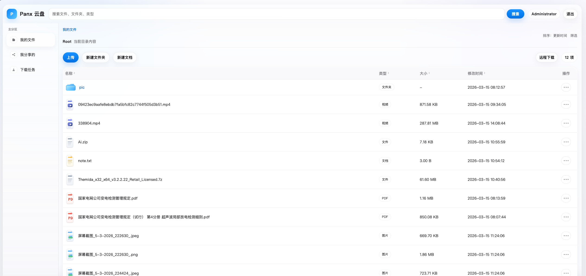

# Panx

基于 Kotlin + Spring Boot 的文件网盘系统（MVP）。

当前仓库目标与协作规范：

- 产品范围与验收：`desc.md`
- 代理协作规范：`AGENTS.md`
- 自动编码执行模板：`codex-prompt.md`

## 技术栈

- Kotlin 2.2.x
- Java 21
- Spring Boot 4.x
- Spring Web MVC
- Thymeleaf
- Spring Data JDBC
- MySQL
- 本地文件系统（保存文件内容）

## MVP 功能范围

首版目标：

- 基础登录
- 文件夹管理
- 文件上传 / 下载 / 删除 / 重命名 / 移动
- 文件列表与搜索
- 文件 / 文件夹分享链接
- 图片 / 文本基础预览
- Thymeleaf 页面
- 基础测试

非首版（仅预留扩展点）：标签分类、评论讨论、版本历史、回收站、RBAC、多租户、云存储等。

## 当前实现状态

当前仓库已经落地以下 MVP 能力：

- 基于 Spring Security 的登录、登出和当前用户查询
- 文件夹浏览、创建、上传、下载、重命名、移动、删除、搜索
- 拖拽上传、文件夹上传、上传进度与取消当前上传
- 本地文件系统存储，MySQL/H2 保存元数据
- 文件 / 文件夹分享链接、过期控制、提取码校验
- 已分享列表、访问次数统计、取消分享
- 远程下载任务、任务列表/状态/取消、新建文本文件
- 图片 / 文本 / 视频 / 音频基础预览与原生播放
- 视频独立播放页，支持分段加载与拖动进度条
- Thymeleaf 登录页、文件页、分享页
- 基础集成测试骨架

当前仍属于 MVP，以下能力只做扩展位说明，未在首版实现：标签、评论、版本控制、回收站、RBAC、多租户、云存储、高级预览、审计报表。

## UI 预览

当前界面采用服务端渲染的网盘工作台布局，整体方向偏轻量、玻璃感和系统化操作体验，覆盖文件管理、分享管理、下载任务和媒体播放几个核心场景。

### 文件工作台

- 左侧为主分区导航，中间为文件列表与操作区，顶部提供全局搜索、账号状态和退出入口。
- 文件列表支持不同类型图标、拖拽上传、行内操作菜单和前端排序，适合作为网盘主工作台的核心页面。



### 视频播放页

- 播放页采用上方播放器、下方信息卡片的单列结构，适合视频与音频等媒体文件独立预览。
- 顶部保留来源与操作入口，支持返回列表、查看原始流和直接下载，便于从文件管理流程切换到播放场景。


## 运行前准备

请先准备：

- JDK 21
- 可用的 MySQL 实例
- 可写的本地文件存储目录

本仓库默认配置项已经补齐，推荐通过环境变量覆盖：

- `PANX_DB_URL`
- `PANX_DB_USERNAME`
- `PANX_DB_PASSWORD`
- `PANX_STORAGE_ROOT`
- `PANX_INIT_ADMIN_USERNAME`
- `PANX_INIT_ADMIN_PASSWORD`
- `PANX_INIT_ADMIN_DISPLAY_NAME`

首次启动会自动执行 `schema.sql`，并按 `panx.security.init-admin.*` 初始化默认管理员。

## 本地启动

```bash
cd /Users/read/IdeaProjects/panx
./gradlew bootRun
```

## 运行测试

```bash
cd /Users/read/IdeaProjects/panx
./gradlew test
```

## 建议配置项（待实现时补齐）

当前已经支持以下关键配置：

- `spring.datasource.url`
- `spring.datasource.username`
- `spring.datasource.password`
- `spring.servlet.multipart.max-file-size`（默认 `2GB`）
- `spring.servlet.multipart.max-request-size`（默认 `4GB`）
- `panx.storage.root-dir`
- `panx.share.default-expire-hours`
- `panx.security.init-admin.enabled`
- `panx.security.init-admin.username`
- `panx.security.init-admin.password`
- `panx.storage.max-text-preview-bytes`
- `panx.share.default-expire-hours`

## 页面路由

- `/login`
- `/app/files`
- `/share/{token}`

## API 路由

认证：

- `POST /api/auth/login`
- `POST /api/auth/logout`
- `GET /api/auth/me`

文件：

- `GET /api/files?parentId=`
- `POST /api/files/folders`
- `POST /api/files/upload`
- `POST /api/files/text`
- `GET /api/files/download-tasks`
- `POST /api/files/download-tasks`
- `DELETE /api/files/download-tasks/{id}`
- `GET /api/files/{id}/download`
- `GET /api/files/{id}/preview`
- `PATCH /api/files/{id}/rename`
- `PATCH /api/files/{id}/move`
- `DELETE /api/files/{id}?recursive=`
- `GET /api/files/search?keyword=`

分享：

- `POST /api/shares`
- `GET /api/shares/{token}`
- `POST /api/shares/{token}/verify`
- `GET /api/shares/{token}/download`
- `GET /share/{token}?parentId=`
- `DELETE /api/shares/{id}`

## 目录建议

建议按以下分层组织代码：

- `config`
- `controller`
- `service`
- `repository`
- `domain`
- `dto`
- `exception`
- `support` / `common`
- `templates`
- `static`

## 开发流程建议

1. 先冻结共享契约（实体字段、表结构、API、DTO、配置项）
2. 再并行开发（认证 / 文件 / 分享 / 页面）
3. 最后统一联调、补测试、更新 README

详细规则见：`AGENTS.md`。

## 测试建议

至少覆盖：

- 启动测试
- 认证流程
- 创建文件夹
- 上传 / 下载
- 重命名 / 移动 / 删除
- 分享创建与访问

## 验收检查（MVP）

- [ ] 可编译
- [ ] 可启动
- [ ] 关键测试通过
- [ ] 页面可访问
- [ ] 核心 API 可用
- [ ] 未实现高级能力已标注为扩展点

## 已知取舍

- 当前使用单管理员/单用户模型作为 MVP 起点，后续可扩展到多用户。
- 删除采用真实删除；文件夹删除通过 `recursive=true` 显式确认递归。
- 文件物理存储路径使用 `owner-id + node-id` 的稳定路径，不随重命名和移动变化。
- 文本预览默认按 UTF-8 截断读取，复杂编码识别和大型文件流式预览留待下一阶段。
- 文件夹分享当前支持匿名浏览已分享目录树，并下载或预览其中的文件；不支持打包下载整个文件夹。
- 本地验证依赖 JDK 21；如果机器上只有 JDK 17/22，Gradle 工具链会拒绝执行，需要先安装或切换到 JDK 21。
